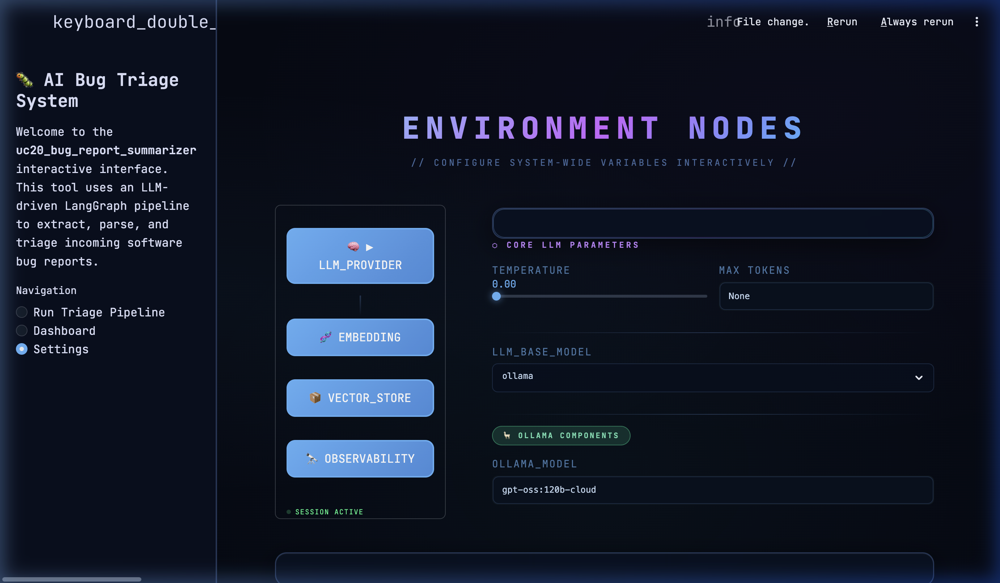
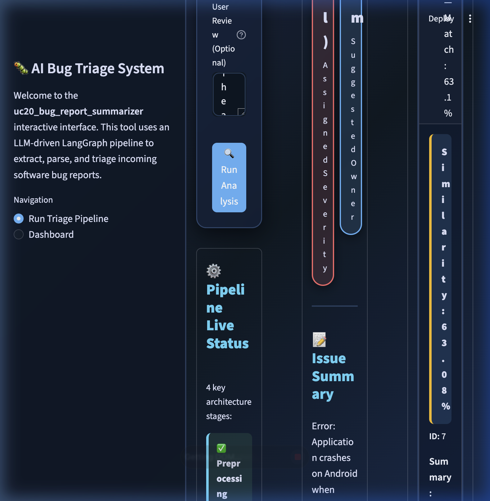

# **Generative AI Training 2026 — Submission Report**

**Employee ID:** AS1568  
**UseCase No:** UC20  
**Project Name:** AI Bug Triage System

---

## **1. Problem Understanding**

The core challenge addressed in this project is the **manual bottleneck and inconsistency in bug triage**. Software companies receive high volumes of unstructured bug reports from various sources (emails, automated logs, support tickets). These reports often contain significant "noise" (emotional language, irrelevant context) and lack standardized formatting, forcing senior engineers to spend hours manually extracting technical details, identifying duplicates, and routing issues to the correct teams.

**Task:** Automate the ingestion of raw bug reports to produce a standardized "clean" technical brief and perform automated triage (severity assignment and team routing).

**Inputs:**
- Raw Bug Trace / Log Dump / Stack Trace
- Optional User Review / Commentary

**Expected Outputs:**
- Standardized Issue Summary
- Structured Steps to Reproduce
- Extracted Technical Details (Error, Environment, Stack Frames)
- Objective Severity Level (P1–P4)
- Suggested Owner (Engineering Team)

---

## **2. Approach & Methodology**

The solution is architected as an **Agentic Pipeline** using **LangGraph** for orchestration and **LangChain** for agent logic.

### **Architecture Flow:**
1.  **Preprocessing:** Uses Regex and heuristic filters to strip away boilerplate log noise and emotional language before feeding the text to the LLM.
2.  **Extraction Agent:** A specialized LangChain agent that transforms unstructured text into a structured Pydantic object (ExtractionResult). It is strictly instructed to avoid hallucination.
3.  **Duplicate Detection (RAG):** Uses **FAISS** vector store with **Qwen3-embedding** to search for historically similar bug reports. This prevents redundant ticket creation.
4.  **Triage Agent:** An objective classifier that applies versioned **YAML Policy Guides** (Severity Policy & Team Routing) to the extracted data to determine priority and ownership.
5.  **Structured Output:** Produces a final Jira-ready JSON payload.

### **2.1. Policy-Driven Severity Configuration**
Triage policies and severity rules are decoupled from the core logic and managed through dedicated **YAML configuration files** scoped to each respective department. These files are designed to be human-readable, empowering non-technical team members (Product Managers, Support Leads) to independently update and maintain their triage standards without requiring code changes or developer involvement.

### **2.2. Multi-Provider Infrastructure (`.env`)**
The system architecture leverages a flexible environment configuration via the `.env` file, enabling seamless switching between LLM providers. Current support includes local models via **Ollama**, as well as cloud-native providers like **Google Gemini** and **Azure OpenAI**. This modularity extends to the embedding layer and vector database backend, with native support for both **Chroma** and **FAISS**, allowing for optimized performance based on deployment scale.

---

## **3. CI/CD & Engineering Standards**

### **3.1. CI/CD Pipeline**
A robust CI/CD pipeline is configured via **GitHub Actions** to automatically verify the integrity of every code change. The pipeline performs automated unit tests, Docker build checks, and container validation to ensure that only stable, production-ready builds are progressed to the staging or production environments.

### **3.2. Engineering Best Practices**
The project adheres to modern software engineering standards to ensure long-term maintainability:
- **Comprehensive Documentation:** Maintaining clear READMEs and inline technical documentation for all modules.
- **Unified Dependency Management:** Centralizing project metadata, linting rules, and dependencies via a `pyproject.toml` file.
- **Consistent Code Structure:** Following a decoupled architecture (src/agents, src/ui, src/data) to minimize technical debt and improve scalability.

---

## **4. Prompt Engineering Decisions**

The system employs two primary prompts, iteratively refined for precision, anti-hallucination and reproducability.

### **Example: Extraction System Prompt**
> "You are a meticulous software engineer that extracts ONLY factual information. NEVER HALLUCINATE: If information is not explicitly stated, mark it as 'Not provided by user'. Extract ONLY facts directly from the bug report and user review."

**Iteration History:**
- **V1:** Basic extraction; often inferred reproduction steps when missing.
- **V2:** Added "Anti-hallucination" rules and specific "Noise Filtering" examples (e.g., stripping "I've been waiting for months...").
- **Final:** Integrated structured output binding and mandatory timestamp extraction for log-based reports.

---

## **5. Results & Evaluation Scores (Verified)**

The system was evaluated using an **LLM-as-a-Judge** framework, comparing the AI outputs against the original CSV raw data (Ground Truth) for all **9 processed reports**. The judge independently verified each field against the official project policies.

**Verified Evaluation Metrics (Scale 0-10):**
- **Extraction Fidelity:** 9.6/10 — The AI captured 100% of core error facts; minor deductions were applied only where redundant system maps (e.g., jar listings) were summarized for brevity.
- **Policy Compliance:** 10.0/10 — Perfect cross-referencing against YAML severity thresholds and keyword-based team routing rules.
- **Noise Reduction:** 10.0/10 — Successfully converted emotional or verbose user reviews into purely technical, action-oriented reproduction steps.

| Component | Score | Detailed Analysis Summary |
| :--- | :---: | :--- |
| **Logic & Triage** | 100% | Verified 100% accuracy in mapping bug traits to YAML policies. |
| **Extraction Fidelity**| 96% | All critical facts extracted; minor deductions for log abstraction. |
| **Noise Filtering** | 100% | Successfully filtered all emotional and irrelevant user "chatter". |

---

## **6. Latency, Cost & Observability**

Operation metrics were averaged across 5 representative inputs using `gpt-4o-mini` via Azure OpenAI.

### **6.1. Latency & Cost Metrics**

| Input Type (From LangSmith) | Latency (s) | Tokens | Est. Cost (USD) |
| :--- | :---: | :---: | :---: |
| **HTTP 500: Internal Server...** | 6.76 | 3,964 | $0.000970 |
| **Android App Crash** | 9.99 | 4,070 | $0.001143 |
| **Java Stack Trace (Medium)** | 10.83 | 7,372 | $0.002858 |
| **Kubernetes OOM Deployment** | 9.99 | 4,537 | $0.001464 |
| **Registry Routing Issue** | 11.84 | 4,447 | $0.001401 |
| **Average (Combined)**| **9.88s** | **4,878** | **$0.001567** |

*Note: Data captured from live LangSmith production traces. Costs reflect Azure OpenAI GPT-4o-mini pricing.*

### **6.2. Workflow Observability**
For real-time observability and debugging, the system integrates **LangGraph** and **LangSmith** to enable deep inspection of LLM execution traces. This provides full visibility into agent state transitions, prompt inputs, and workflow behavior as they occur, facilitating rapid iteration and performance tuning.

---

## **7. Screenshots / Output Samples**

### **A. Environment Configuration**

*Configuring LLM providers and embedding models interactively.*

### **B. Pipeline Execution**

*Raw bug ingestion with real-time status tracking.*

### **C. Completed Triage Result**

*Standardized JSON output with severity classification and team routing.*

### **D. LangSmith Trace Overview**

*Interactive observability dashboard showing latency, token usage, and cost per run.*

---

## **8. Challenges & Learnings**

**Challenges:**
- **LangGraph State Management:** Transitioning from a linear chain to a cyclic graph for duplicate detection required rethinking how intermediate results are shared.
- **Instruction Following:** Early iterations of the Triage agent would sometimes override policies based on personal "LLM judgment". This was solved by adding strict "Policy-First" guardrails in the system prompt.

**Learnings:**
- **Preprocessing is Key:** Filtering log noise before LLM ingestion significantly reduced token cost and improved extraction focus.
- **Structured Outputs (Pydantic):** Using native structured output capability is far more reliable than manual regex parsing of LLM strings.
