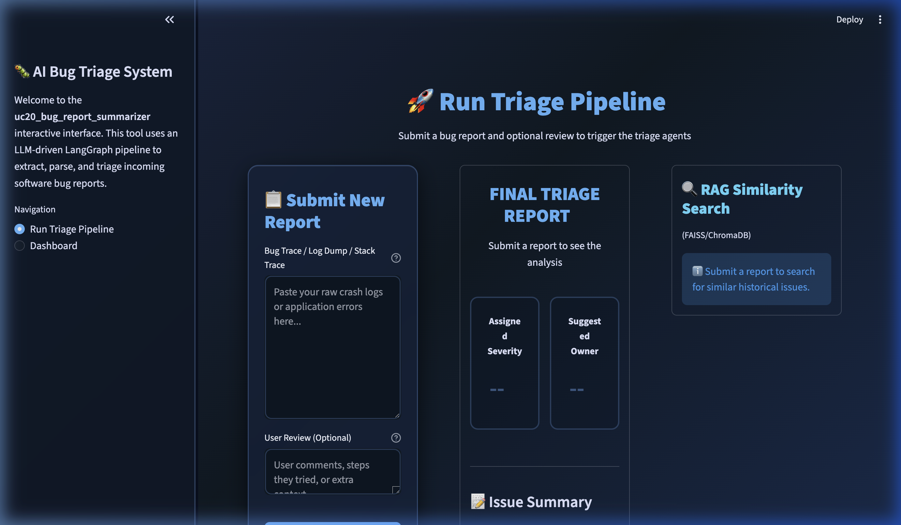
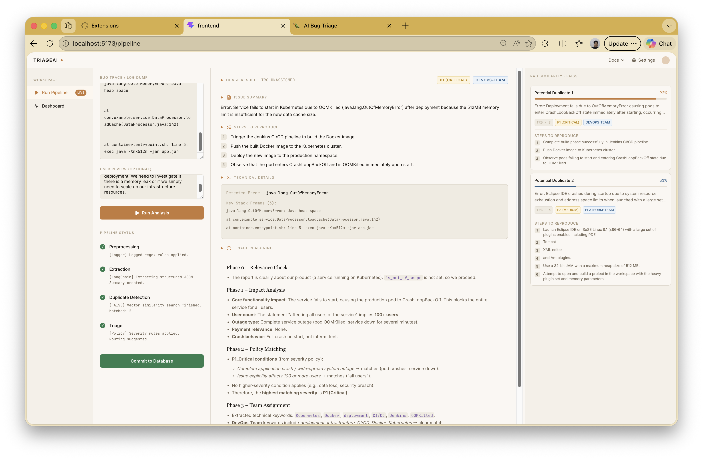

# 🐛 AI Bug Triage System

> Automate the ingestion of unstructured bug reports and produce standardised, clean technical briefs — ready for Jira / GitHub Issues.

> In this project, Triage refers to the automated process of analyzing raw bug logs to determine their severity level (e.g., P1 vs P2) and assigning them to the correct engineering team. It uses AI to evaluate technical impact and reproduction steps so that incoming issues can be prioritized and routed without manual human review.

## 🏗️ Architecture Overview

```
Raw Bug Report → Preprocessing (Regex/Noise Filter)
                    ↓
              Extraction Agent (LangChain → Structured JSON)
                    ↓
              Duplicate Detection (FAISS/ChromaDB RAG)
                    ↓
              Triage Agent (Severity + Team Assignment)
                    ↓
              Structured Output (JSON → Jira-ready)
```

## ✨ Key Features

| Feature | Description |
|---------|-------------|
| **Signal-to-Noise Filtering** | Strips emotional language, memory dumps, and irrelevant context from bug reports |
| **Structured Extraction** | Converts raw text into standardised JSON (summary, steps, technical details) |
| **Duplicate Detection** | Uses vector embeddings + similarity search to flag potential duplicate tickets |
| **Auto-Severity Assignment** | Applies configurable policy rules (P1–P4) based on impact analysis |
| **Team Routing** | Suggests the responsible team (Frontend, Backend, Mobile, etc.) |
| **Internal Telemetry** | Logs latency, token usage, costs, and errors for every request |

## 🛠️ Tech Stack

- **UI**: Streamlit
- **AI Orchestration**: LangChain (Agents + Memory)
- **Vector Database**: FAISS / ChromaDB
- **Core Logic**: Python (Regex for log parsing)
- **Data Models**: Pydantic v2
- **Configuration**: YAML policy files + Pydantic BaseSettings
- **Monitoring**: Python `logging` + custom metrics

## 📁 Project Structure

```
UC20 - Bug Report Summarizer & Triage Assistant/
│
├── README.md                         # Project-level overview, setup instructions
├── pyproject.toml                    # Dependencies, build config (PEP 621)
├── requirements.txt                  # Pinned pip dependencies (alternate install)
├── .env copy                         # Template for environment variables
├── .gitignore                        # Python / data / IDE ignores
├── Makefile                          # Common dev commands
├── Problem Statement.md              # [EXISTING] — untouched
│
├── src/                              # ── All production source code ──
│   ├── __init__.py
│   ├── README.md
│   │
│   ├── preprocessing/                # Log noise trimming (regex, heuristics)
│   │   ├── __init__.py
│   │   ├── noise_filter.py           # Strips emotional language, memory dumps, etc.
│   │   ├── text_cleaner.py           # Unicode, whitespace normalisation
│   │   └── README.md
│   │
│   ├── schemas/                      # Pydantic data models
│   │   ├── __init__.py
│   │   ├── triage_output.py          # TriageResult output model (JSON contract)
│   │   ├── duplicate_result.py       # DuplicateMatch model
│   │   └── README.md
│   │
│   ├── agents/                       # LangChain agent definitions
│   │   ├── __init__.py
│   │   ├── agent.py                  # Contains all the necessary agent definitions
│   │   ├── extraction_agent.py       # Raw text → structured JSON
│   │   ├── triage_agent.py           # Severity + owner classification
│   │   ├── orchestrator.py           # End-to-end pipeline controller
│   │   └── README.md
│   │
│   ├── prompts/                      # Prompt templates (system + user)
│   │   ├── __init__.py
│   │   ├── extraction_prompts.py     # Prompts for the extraction agent
│   │   ├── triage_prompts.py         # Prompts for severity / owner classification
│   │   ├── evaluation_prompt.py      # Prompts for evaluation
│   │   └── README.md
│   │
│   ├── duplicate_detection/          # RAG / vector similarity
│   │   ├── __init__.py
│   │   ├── embeddings.py             # Embedding wrapper (Ollama)
│   │   ├── vector_store.py           # FAISS or ChromaDB operations
│   │   ├── similarity.py             # Compare new report vs. existing tickets
│   │   └── README.md
│   │
│   ├── policies/                     # Externalised business rules
│   │   ├── severity_policy.yaml      # P1–P4 thresholds and rules
│   │   ├── team_routing.yaml         # Component → Team mapping
│   │   └── README.md
│   │
│   ├── telemetry/                    # Internal monitoring & audit
│   │   ├── __init__.py
│   │   ├── logger.py                 # Structured Python logging setup
│   │   ├── metrics.py                # Latency, token usage, error counters (yet to work upon)
│   │   ├── audit_trail.py            # Per-request audit log writer (yet to work upon)
│   │   ├── llm_observability.py      # LangSmith / LangFuse Integration for observability (yet to work upon)
│   │   └── README.md
│   │
│   └── ui/                           # Streamlit application
│       ├── __init__.py
│       ├── app.py                    # Main Streamlit entry point
│       ├── views/
│       │   ├── __init__.py
│       │   ├── Dashboard.py           # Give analytics of our dataset
│       │   ├── main_pipeline_page.py  # Running the main pipeline under UI
│       │   └── README.md
│       ├── components/
│       │   ├── __init__.py
│       │   ├── result_display.py     # Encapsulate the Streamlit UI code required to display the `TriageResult`
│       │   └── README.md
│       └── README.md
│
├── Data/                             # ── Data storage ──
│   ├── README.md
│   ├── raw/                          # Immutable source files
│   └── bug_report.csv                # Original CSV file
│   │   └── README.md                 # (bug_report.csv lives next door in Data/)
│   ├── processed/                    # Cleaned / transformed outputs
│   │   ├── evaluation_results.json   # getting the evalution metrics
│   │   ├── processed_bug_reports.json # Contains the output of each given llm traces
│   │   └── README.md
│   ├── vector_store/                 # FAISS / ChromaDB index files
│   │   └── README.md
│   ├── Validation Data/              # [EXISTING] — untouched
│   │   └── Validation Input.md
│   └── temp/                         # Ephemeral scratch files
│       └── README.md
│
├── tests/                            # ── Test suite ──
│   ├── __init__.py
│   ├── README.md
│   ├── __init__.py
│   ├── benchmark_pipeline.py
│   └── test_pipeline_backend.py
│
├── scripts/                          # ── Utility scripts ──
│   ├── README.md
│   ├── load_json_data.py             # Ingest raw CSV into data/processed/processed_bug_reports.json
│   └── build_vector_index.py         # Build FAISS/ChromaDB index from historical data
```

### Top-level files
- `README.md` — project overview, quick-start, architecture summary
- `pyproject.toml` — dependencies and project metadata
- `requirements.txt` — pinned dependencies
- `.env.example` — env var template
- `.gitignore` — Python/data ignores

## **Screenshots / Output Samples**

### **A. Environment Configuration**

*Configuring LLM providers and embedding models interactively.*

### **B. Pipeline Execution**

*Raw bug ingestion with real-time status tracking.*

### **C. Completed Triage Result**

*Standardized JSON output with severity classification and team routing.*

### **D. LangSmith Trace Overview**

*Interactive observability dashboard showing latency, token usage, and cost per run.*

---

## 🚀 Quick Start

```bash
# 1. Clone and enter the project
cd "UC20 - Bug Report Summarizer & Triage Assistant"

# 2. Install uv (Python package manager, not pip)
pip install uv

# 3. Create virtual environment and install dependencies
uv sync

# 4. Install numpy (required for embeddings)
uv add numpy

# 5. Install Ollama (for local embedding model)
# Mac / Linux:
curl -fsSL https://ollama.com/install.sh | sh

# Windows:
# Download installer from https://ollama.com/download

# 6. Pull the embedding model
ollama pull qwen3-embedding:0.6b

# 7. Set up environment variables
mv ".env copy" .env

# Add the following inside .env:
# OPENAI_API_KEY=your_key_here
# EMBEDDING_MODEL=qwen3-embedding:0.6b

# 8. Run the Streamlit app
streamlit run main.py
```
## React App

## ⚛️ React App (Frontend)

### 1. Install Node.js (includes npm)

Download and install Node.js (npm is included):
[https://nodejs.org/](https://nodejs.org/)

```bash
# Verify installation
node -v
npm -v
```

---

### 2. (Optional) Install React Tooling

```bash
# Install Vite (modern React tooling)
npm install -g create-vite
```

---

### 3. Install & Run the Project

```bash
# Navigate to frontend
cd src/ui_react/frontend

# Install dependencies
npm install

# Go back to root
cd ../../..

# Run development server
npm run dev
```

---

### 4. (Optional) Verify Ollama is Running

```bash
ollama list
```


> 📘 **For a complete setup guide, see [guide.md](./guide.md)**

## 📋 Expected Output Format

```json
{
  "issue_summary": "Inconsistent 'Purchase' button failure on iPad/Safari",
  "steps_to_reproduce": [
    "Open app on iPad (v17.2)",
    "Add item to cart",
    "Navigate to Checkout",
    "Click 'Purchase' button multiple times"
  ],
  "technical_details": {
    "detected_error": "Timeout in API call /v1/transactions",
    "environment": "iOS Safari"
  },
  "severity": "P1 (Critical - Revenue Impacting)",
  "suggested_owner": "Payments-Backend-Team"
}
```

## 📄 License

This project is for educational and internal use.